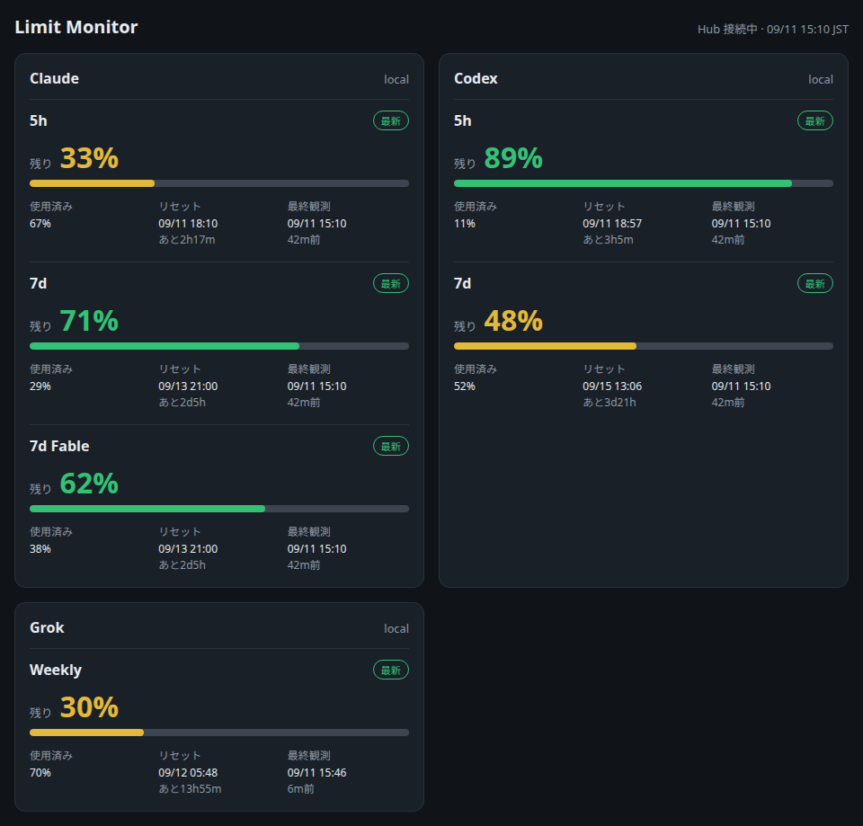

# limit-monitor

Codex CLI / Claude Code / Grok Build の利用上限を収集し、Hub APIとWeb Dashboardで確認するNode.jsアプリケーションです。



## 構成

```text
Codex CLI / Claude Code / Grok Build
        │
        ▼
limit-collector ──▶ limit-hub ──▶ limit-dashboard
                    SQLite       React SPA
```

- `limit-collector`: ローカルのCodex / Claude CLI、Grok BuildのACP billing APIから実値を取得してHubへ送信
- `limit-hub`: 認証、観測値の保存、Dashboard向けAPI
- `limit-dashboard`: Hub APIを表示するWeb Dashboard

既定ではmock値を使いません。fixtureを使う場合だけ`COLLECTOR_MODE=mock`を明示します。

## 必要環境

- Node.js 24.x
- npm
- 選択したproviderに応じて Codex CLI / Claude Code / Grok Build
- Codex / Claudeを選ぶ場合は、Collectorを実行するユーザーで各CLIへlogin済みであること
- Grokを選ぶ場合は、Collectorを実行するユーザーでGrok CLIへlogin済みであること

## 開発環境

```bash
npm ci
npm run build --workspaces --if-present
npm run test --workspaces --if-present
```

Hubを起動:

```bash
npm run db-migrate -w hub
npm run dev:hub
# http://127.0.0.1:8787
```

Dashboardを起動:

```bash
npm run dev:dashboard
# http://localhost:5173
```

Collectorを手動起動する場合は、Hub tokenを環境変数で渡します。

```bash
HUB_TOKEN=<token> \
SOURCE_ID=<source-id> \
npm run start -w collector
```

実データから収集する既定モード:

```bash
COLLECTOR_MODE=real
```

明示的にmockを使う場合:

```bash
COLLECTOR_MODE=mock HUB_TOKEN=<token> SOURCE_ID=<source-id> \
  npm run start -w collector
```

## 初回構築

以下は**初めてsystemdへ配置する場合の順番**です。`collector-token`を配置する前にdeployすると、token不足で停止します。

1. 使用するproviderを決めます。Codex / Claude / Grokを使う場合はCollectorを実行する通常ユーザーで各CLIへloginします。GrokはACP billing APIを利用します。
2. state directoryをinstall user所有で作成します。
3. production DBをmigrationし、Hub tokenを発行します。
4. 発行されたtokenをroot所有・mode `600`で配置します。
5. `sudo ./deploy.ts`を、使用するproviderを`--providers`で指定して実行します。build / validation / release配置 / systemd反映はTypeScriptのdeploy処理が行います。

```bash
# state directory（sudoする前の通常ユーザー名・group名を使う）
sudo install -d -o "$(id -un)" -g "$(id -gn)" -m 0755 \
  /var/lib/limit-monitor

# production DBをmigrationし、Collectorの識別値を決める
SOURCE_ID=dev-machine
ACCOUNT_ALIAS=local
DB_FILE_PATH=/var/lib/limit-monitor/limit-monitor.sqlite \
  npm run -s db-migrate -w hub

DB_FILE_PATH=/var/lib/limit-monitor/limit-monitor.sqlite \
  npm run -s tokens -w hub -- issue \
  --source-id "$SOURCE_ID" --account-alias "$ACCOUNT_ALIAS"

# 上のコマンドで一度だけ表示されたtokenのvalueを標準入力から配置する
sudo install -d -m 0755 /etc/limit-monitor
sudo install -m 600 /dev/stdin /etc/limit-monitor/collector-token
# コマンド実行後、tokenのvalueを貼り付けてからCtrl-Dで入力を終了する
# 直接ファイルを配置/編集してもよい

# systemdへ初回配置（Hub + Dashboard + Collector）
sudo ./deploy.ts \
  --server --collector \
  --providers codex,claude,grok \
  --hub-base-url http://127.0.0.1:8787
```

`collector-token`が未配置、空、symlink、root所有でない、mode `600`でない場合は、deployはunit配置前に停止します。各項目の詳細や既存hostからの移行は[`docs/operations.md`](docs/operations.md)を参照してください。

## Deploy

正規の入口はリポジトリrootの`deploy.ts`です。deploy orchestrationはTypeScriptで実装されており、外部コマンドはshell文字列を組み立てずに引数配列で実行します。

```bash
# Hub + Dashboard
sudo ./deploy.ts --server --hub-base-url http://127.0.0.1:8787

# Collector: Codex + Claude + Grok
sudo ./deploy.ts \
  --collector \
  --providers codex,claude,grok \
  --hub-base-url http://127.0.0.1:8787

# Grokだけ
sudo ./deploy.ts \
  --collector \
  --providers grok \
  --hub-base-url http://127.0.0.1:8787

# 全サービス
sudo ./deploy.ts \
  --server --collector \
  --providers codex,claude,grok \
  --hub-base-url http://127.0.0.1:8787
```

`--server`はHubとDashboard、`--collector`はCollectorを対象にします。`--providers`は`--collector`と組み合わせ、`codex,claude,grok`から1つ以上をカンマ区切りで指定します。

`--providers`を明示した場合は、既存の`/etc/limit-monitor/collector.env`を基準に`COLLECTOR_PROVIDERS`だけを更新したcandidateを作り、そのcandidateを使ってCLI存在確認などのread-only validationをすべて実行します。全validationに成功した後だけ、正規化したprovider一覧を`collector.env`へatomicに永続化します。既存ファイルの他の設定・コメント・mode/ownerは保持します。systemd unitへ一時的な`Environment=COLLECTOR_PROVIDERS=...` overrideは追加しません。

`--providers`を省略した場合、既存の`collector.env`は書き換えず、そこに永続化済みの`COLLECTOR_PROVIDERS`をそのまま利用します。既存envがない初回deployでのみ`deploy/collector.env.example`の既定値を使います。空要素・未知provider・重複provider、`--collector`なしの`--providers`は設定変更前にfail-closedで拒否されます。既存envにactiveな重複keyがある場合も配置前に停止します。

何もサービスを指定しない場合や未知の引数は失敗します。同じ`package.json` versionを再配置する場合は、明示的に`--force`を追加します。

Deployを実行した通常ユーザーが、3サービスのsystemd実行ユーザーになります。専用Linux userやgroupは作成しません。`sudo`経由では`SUDO_USER`とprimary groupを自動解決します。rootへ直接loginして実行する場合は拒否されます。

Codex / Claudeをproviderとして選ぶ場合、同じinstallユーザーで対象CLIへlogin済みである必要があります。Grokだけを選択した場合、Codex / Claude CLIはdeploy時に要求されません。tokenや手編集された非管理systemd unitはdeployで黙って上書きしません。

初回構築は上の「初回構築」を先に実行してください。既存hostの移行、rollback、CORS、systemd状態確認は[`docs/operations.md`](docs/operations.md)を参照してください。

## サービスと既定ポート

- Hub: `127.0.0.1:8787`
- Dashboard: `127.0.0.1:8788`
- Collector: listenなし

DashboardはNode.js組み込みHTTP serverで配信するため、nginxは必須ではありません。LANへ公開する場合はDashboardのbind address、public origin、HubのCORSを明示的に一致させてください。

## API契約

APIの基準となる定義はTypeSpecです。

```bash
npm run compile -w shared
npm run openapi-ts -w shared
```

通常は`npm run build -w shared`から自動実行されます。

## ドキュメント

- [Architecture](docs/architecture.md)
- [Operations / Deploy](docs/operations.md)
- [Decisions](docs/decisions.md)
- [Security](SECURITY.md)

## License

未定義です。公開前にLICENSEを追加してください。
