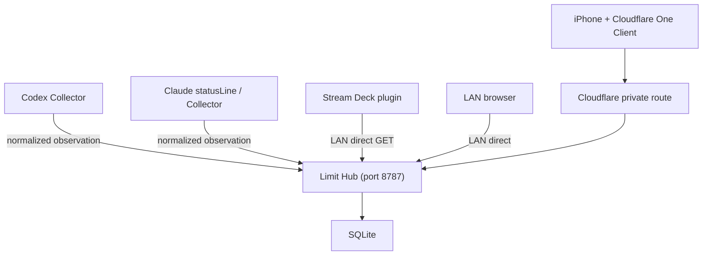

# Architecture

仕様書(hermes-limit-monitoring-spec.md)の確定アーキテクチャに基づく実装構成。

## 全体像



- Hub は自宅 Linux サーバー(開発機)上で systemd により常駐する
- Cloudflare はアプリ実行基盤・永続化先として使わず、iPhone からの private route のみに使う
- Phase 1 では collector は fixture を送信する mock 実装

## package 構成

```text
limit-monitor/
  packages/
    shared/      # 契約 schema(zod/mini)、freshness/残量/最新値選択、Drizzle DB schema
    hub/         # Hono API server。Ingest/Status/health、token 管理 CLI、migration
    client/      # Next.js App Router Dashboard
    collector/   # mock collector(Codex/Claude fixture 送信)
  deploy/systemd/
  docs/
```

## データフロー

1. Collector が vendor 固有データを正規化した Observation payload を
   `POST /api/v1/observations`(Bearer token)へ送信する
2. Hub は envelope を zod で検証し、bucket 単位の partial acceptance を行う
   (不正な bucket が 1 件あっても他の正常 bucket を破棄しない)
3. 最新値選択(`shared/src/selection.ts`):
   - 新しい `observedAt` を採用
   - 古い観測の遅延到着は上書きしない
   - `observedAt` 同時刻なら新しい `receivedAt` を採用
   - Hub 時刻より 5 分以上未来の `observedAt` は 400 で拒否
4. `latest_limits`(provider + account_alias + bucket_id が PK)へ upsert する
5. Dashboard / Stream Deck は `GET /api/v1/status` を取得して表示する

## Hub API

| Method | Path | 認証 | 用途 |
| --- | --- | --- | --- |
| GET | `/healthz` | 不要 | process health(version / schemaVersion を返す) |
| GET | `/readyz` | 不要 | DB を含む readiness |
| GET | `/api/v1/status` | private network 制限 | 全 provider の最新状態 |
| GET | `/api/v1/status/:provider` | private network 制限 | provider 別状態 |
| POST | `/api/v1/observations` | Collector Bearer Token | 観測値登録 |

エラーレスポンスは RFC 9457 Problem Details 形式。

Ingest の保護:

- リクエストボディ上限 32KB(413)
- token 認証失敗 401 / sourceId mismatch 403
- sourceId 単位の in-memory fixed window rate limit(429)

## Freshness

| 状態 | 条件 |
| --- | --- |
| `fresh` | 最終観測から 10 分未満 |
| `stale` | 10 分以上 24 時間未満 |
| `expired` | 24 時間以上 |
| `never` | 一度も有効値なし |

`stale` は障害と同義ではない(Claude はセッション非稼働時に更新されない)。
Dashboard では Hub 到達不能(`offline`)と `stale` を別表示する。

## 永続化

- SQLite + Drizzle ORM(`drizzle-orm/node-sqlite`、driver は Node 組み込みの `node:sqlite`)
- schema は `packages/shared/src/db/schema.ts` を単一ソースとする
- migration は `drizzle-kit generate` で SQL を生成し、Hub 起動時と
  `npm run db-migrate -w hub` で適用する。`drizzle-kit push` は検証用途のみ
- MVP のテーブルは `latest_limits` と `collector_tokens` のみ(履歴保存なし)
- WAL mode。DB ファイルは永続 volume に置き、再起動後も最新値が残る

## Dashboard(packages/client)

- Next.js App Router。データ取得は server component + server action(`actions.ts`)
- provider / accountAlias ごとのカード表示。bucket は固定 2 枠ではなく動的に描画
- 残量主表示(「残り」と明記)、使用済み%、リセット日時(Asia/Tokyo)と相対時間、
  最終観測時刻、freshness、Hub 接続状態
- 色: 残量 50%以上=緑、20%以上50%未満=黄、20%未満=赤、stale/expired=グレー、
  取得不能=ダークグレー
- 60 秒間隔の自動再取得と、バックグラウンド復帰(visibilitychange)時の再取得
