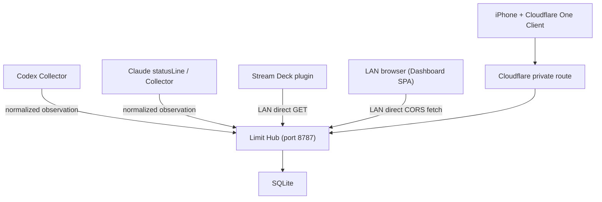

# Architecture

仕様書(hermes-limit-monitoring-spec.md)の確定アーキテクチャに基づく実装構成。

## 全体像



- Hub は自宅 Linux サーバー(開発機)上で systemd により常駐する
- Hub / Dashboard / Collector の 3 unit は **deploy を実行した通常ユーザー
  (install user)** として動く。limit-monitor 専用の Linux user は作らず、
  利用者に user / group を指定させない(`sudo` の SUDO_USER、または非 root
  実行時の現在のユーザーから自動解決し、主体不明なら fail-closed)
- Cloudflare はアプリ実行基盤・永続化先として使わず、iPhone からの private route のみに使う
- Phase 1 の collector は real 実行(既定 `COLLECTOR_MODE=real`)。
  fixture 送信は `COLLECTOR_MODE=mock` を明示した場合のみ有効になる

## package 構成

```text
limit-monitor/
  packages/
    shared/      # API 契約(TypeSpec → OpenAPI → TS 型)、契約 schema(zod/mini)、
                 # freshness/残量/最新値選択、Drizzle DB schema
    hub/         # Hono API server。Ingest/Status/health/refresh、control WebSocket、
                 # token 管理 CLI、migration
    client/      # Vite + React + react-router Dashboard(SPA、Hub へ直接 CORS fetch)
    collector/   # Agent(WebSocket/reconnect) + one-shot Worker。Worker が
                 # Codex/Claude CLI から usage を観測し Observation を Hub へ送信
  deploy/systemd/
  docs/
```

## データフロー

1. Collector が vendor 固有データを正規化した Observation payload を
   `POST /api/v1/observations`(Bearer token)へ送信する
2. Hub は envelope を zod で検証し、bucket 単位の partial acceptance を行う
   (不正な bucket が 1 件あっても他の正常 bucket を破棄しない)
3. 最新値選択(`shared/src/selection.ts`):
   - 新しい `observedAt` を採用
   - 古い観測の遅延到着は上書きしない
   - `observedAt` 同時刻なら新しい `receivedAt` を採用
   - Hub 時刻より 5 分以上未来の `observedAt` は 400 で拒否
4. `latest_limits`(provider + account_alias + bucket_id が PK)へ upsert する
5. Dashboard / Stream Deck は `GET /api/v1/status` を取得して表示する

## API 契約(TypeSpec)

API 契約の単一ソースは `packages/shared` の TypeSpec 定義である。

```text
packages/shared/
  main.tsp                  # service 定義、共通 scalar、RFC 9457 エラーモデル
  typespec/health.tsp       # /healthz, /readyz
  typespec/status.tsp       # /api/v1/status, /api/v1/status/{provider}
  typespec/observations.tsp # /api/v1/observations
  typespec/refresh.tsp      # /api/v1/refresh-requests
  tspconfig.yaml            # openapi3 emitter 設定(OpenAPI 3.1)
  tsp-output/schema/openapi.yaml  # 中間生成物(git 管理しない)
  src/generated/schema.ts   # openapi-typescript の生成型(git 管理しない)
  src/schema.ts             # 生成型の re-export(`shared/src/schema`)
```

生成の流れ(`npm run build -w shared` の prebuild で自動実行される):

```text
main.tsp --(tsp compile)--> tsp-output/schema/openapi.yaml
         --(openapi-typescript)--> src/generated/schema.ts
```

### 型と runtime 検証の役割分担

- **型(compile time)**: TypeSpec 生成型。Hub の route path / validator の戻り値型 /
  レスポンスを `satisfies` で契約に固定する
- **runtime**: zod/mini(`packages/shared/src/contracts.ts`)。生成型は型情報しか
  持たないため、実際の入力検証は従来どおり zod が行う
- 両者の drift は `packages/shared/src/schema.test.ts` が型レベルで検出する
  (zod 推論型と TypeSpec 生成型の相互代入可能性を tsc で強制する)
- OpenAPIと生成型はbuild時に毎回生成するため、生成結果はgit管理しない。契約の変更は
  TypeSpecソースと `schema.test.ts` の型検査でレビューする

### 契約表現上の妥協点

- `Observation.buckets` は TypeSpec 上も `unknown[]`(OpenAPI では `items: {}`)にしている。
  bucket 単位の partial acceptance を行うため envelope 検証では中身を確定させず、各要素を
  `observationBucketSchema` で個別に検証する実装をそのまま契約にした。1 要素の形は
  `components['schemas']['ObservationBucket']` として別途公開している
- Problem Details の `status` は各エラーモデルで数値リテラル(400 / 401 / ...)に固定している。
  そのため `createHttpException<...>` の型引数がステータスと食い違うと tsc で落ちる

### ルーティング型安全化の3点セット

1. パス: `app.get('/api/v1/status' satisfies keyof schema.paths, ...)`
2. レスポンス: `return c.json(res satisfies ...['responses']['200']['content']['application/json'])`
3. validator の戻り値型注釈: `validator('json', (value): IngestApi['requestBody']['content']['application/json'] => ...)`

3 が最も重要で、zod schema が契約とズレた場合に tsc が検出できる唯一のポイントになる。

既知の限界: Hono はパスパラメータを `:provider` で表すが TypeSpec/OpenAPI は
`{provider}` で表すため、`/api/v1/status/:provider` には `satisfies keyof schema.paths`
を付けられない。この route は型側の参照
(`schema.paths['/api/v1/status/{provider}']['get']`)で契約と紐付ける。

## Hub API

| Method | Path | 認証 | 用途 |
| --- | --- | --- | --- |
| GET | `/healthz` | 不要 | process health(version / schemaVersion を返す) |
| GET | `/readyz` | 不要 | DB を含む readiness |
| GET | `/api/v1/status` | private network 制限 | 全 provider の最新状態 |
| GET | `/api/v1/status/:provider` | private network 制限 | provider 別状態 |
| POST | `/api/v1/observations` | Collector Bearer Token | 観測値登録 |
| POST | `/api/v1/refresh-requests` | `HUB_REFRESH_TOKEN` Bearer | provider + accountAlias 単位の durable refresh 要求 |
| GET | `/api/v1/refresh-requests/:id` | 不要 | refresh 要求の状態取得 |
| WebSocket | `/api/v1/collector/control` | Collector Bearer Token | Collector Agent への outbound control / lifecycle 通知 |

エラーレスポンスは RFC 9457 Problem Details 形式。media type は経路によって異なり、
契約(TypeSpec)側もこの実装の挙動に合わせている。

| 経路 | status | Content-Type |
| --- | --- | --- |
| `createHttpException`(各 operation) | 400 / 401 / 403 / 413 / 429 | `application/problem+json` |
| `app.notFound` | 404 | `application/json` |
| `handleError` の最終 fallback | 500 | `application/json` |

404 / 500 は個別 operation ではなく app 全体の fallback であり、`c.json()` で返すため
`application/json` になる。契約上も `components['schemas']['NotFoundError']` /
`InternalServerError` を直接参照する形にしている。

Ingest の保護:

- リクエストボディ上限 32KB(413)
- token 認証失敗 401。認証成功後の`sourceId`はtokenに紐付く値へHub側で正規化する
- sourceId 単位の in-memory fixed window rate limit(429)

## CORS(ブラウザ直接アクセス)

Dashboard は reverse proxy を介さず、ブラウザから Hub の API へ直接 fetch する SPA のため、
Hub 側で CORS を明示的に許可する必要がある(`packages/hub/src/config.ts` の
`resolveCorsAllowedOrigins`、`packages/hub/src/app.ts` の `cors()` middleware)。

- 許可 origin は環境変数 `CORS_ALLOWED_ORIGINS`(カンマ区切り)で指定する
- exact origin match のみを許可し、denied origin には
  `Access-Control-Allow-Origin` を付けない(値は 200/204 のままヘッダーで拒否を表現する)
- `local` / `test` では `CORS_ALLOWED_ORIGINS=*` を許容する(開発時の簡易設定)
- `production`(`APP_ENV=production`)では `*` および未設定を fail closed で拒否し、
  起動時に例外で落とす。**明示的な origin 一覧を必ず設定すること**
  (例: `CORS_ALLOWED_ORIGINS=https://dashboard.example.com`)
- 許可するのは「ブラウザが実際に送る origin」であり、Dashboard の bind address
  (`HOST`、例: `0.0.0.0`)ではない。LAN bind の場合は
  `dashboard.env` の `DASHBOARD_PUBLIC_ORIGIN` に相当する値を設定する
  (localhost 既定 bind `HOST=127.0.0.1` のみ `http://127.0.0.1:8788` が導出される)
- Collector からの ingest リクエストのように `Origin` header がない場合は
  CORS ヘッダーを付けない(CORS はブラウザ間のみの制約であり、Bearer token 認証とは独立)

## Freshness

| 状態 | 条件 |
| --- | --- |
| `fresh` | 最終観測から 10 分未満 |
| `stale` | 10 分以上 24 時間未満 |
| `expired` | 24 時間以上 |
| `never` | 一度も有効値なし |

`stale` は障害と同義ではない(Claude はセッション非稼働時に更新されない)。
Dashboard では Hub 到達不能(`offline`)と `stale` を別表示する。

## 永続化

- SQLite + Drizzle ORM(`drizzle-orm/node-sqlite`、driver は Node 組み込みの `node:sqlite`)
- schema は `packages/shared/src/db/schema.ts` を単一ソースとする
- migration は `drizzle-kit generate` で SQL を生成し、Hub 起動時と
  `npm run db-migrate -w hub` で適用する。`drizzle-kit push` は検証用途のみ
- MVP のテーブルは `latest_limits`、`collector_tokens`、`refresh_requests`（scope 単位で active request を coalesce し、terminal status は保持する。queued request は 24 時間で自動 purge）
- WAL mode。DB ファイルは永続 volume に置き、再起動後も最新値が残る

## Dashboard(packages/client)

- Vite + React + react-router data-loader。データ取得はブラウザから Hub へ直接 fetch する
- provider / accountAlias ごとのカード表示。bucket は固定 2 枠ではなく動的に描画
- 残量主表示(「残り」と明記)、使用済み%、リセット日時(Asia/Tokyo)と相対時間、
  最終観測時刻、freshness、Hub 接続状態
- 色: 残量 50%以上=緑、20%以上50%未満=黄、20%未満=赤、stale/expired=グレー、
  取得不能=ダークグレー
- 60 秒間隔の自動再取得と、バックグラウンド復帰(visibilitychange)時の再取得
- 各 provider + accountAlias カードの更新ボタンは Hub の durable refresh request API を使う。
  Hub は collector の outbound control WebSocketへ配送し、Dashboard は最大 5 分間 request status を
  500ms 間隔で polling する。completed 後に status を再取得し、failed / timeout は明示表示する。
